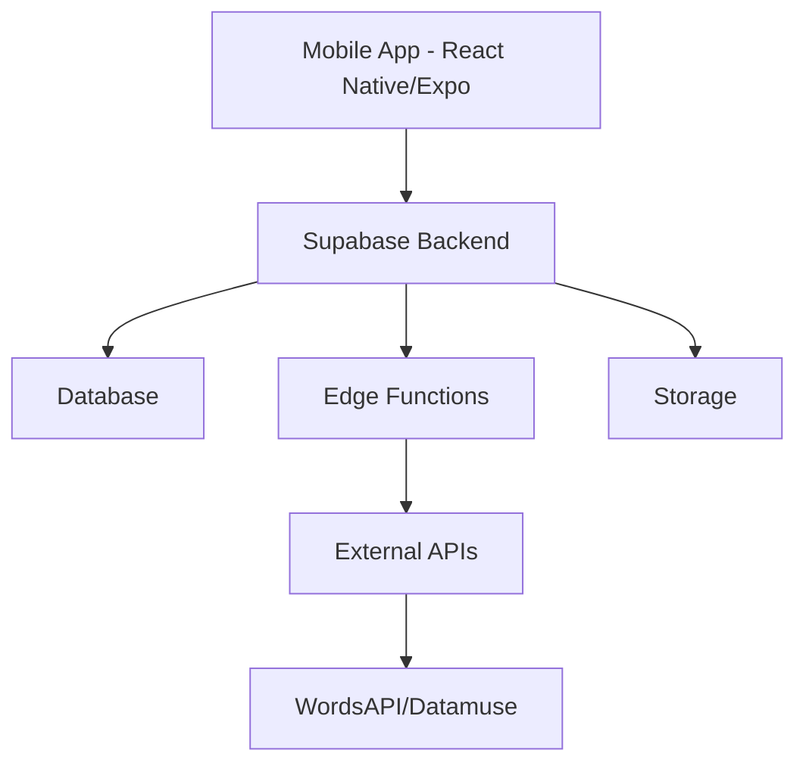
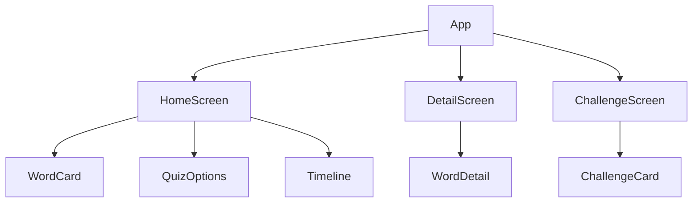
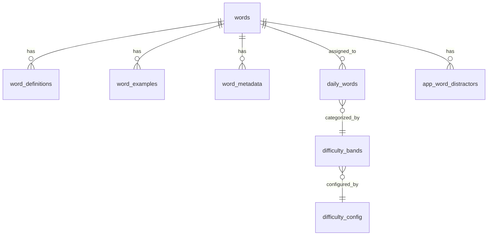

# OneWord - System Patterns

## System Architecture

OneWord follows a client-server architecture with the following components:



### Client (Mobile App)
- **Framework**: React Native with Expo
- **State Management**: Zustand for global state
- **Navigation**: Expo Router
- **Storage**: AsyncStorage for local caching
- **UI Components**: Custom component library based on design system

### Server (Supabase)
- **Database**: PostgreSQL with custom tables and views
- **Authentication**: Anonymous sessions with device ID tracking
- **Edge Functions**: Serverless functions for word processing
- **Scheduled Jobs**: Cron jobs for daily word selection
- **Storage**: Supabase Storage for media assets

## Key Technical Decisions

### 1. Data-First Approach
- Prioritize data quality and enrichment before feature implementation
- Pre-calculate and store derived data (difficulty scores, distractors)
- Minimize runtime calculations for better performance

### 2. Offline-First Design
- Cache essential data locally for offline functionality
- Implement sync mechanisms for reconnection
- Graceful degradation of features when offline

### 3. Phased Implementation
- Phase 1: Core Linguistic Data Enrichment (Completed)
- Phase 2: Difficulty Calculation & Scoring (Current)
- Phase 3: Distractor Generation (Planned)
- Phase 4: Advanced Educational Features (Planned)

### 4. Optimized Word Selection
- Multi-factor difficulty calculation
- Balanced part-of-speech distribution
- Pre-assignment of daily words

### 5. Scalable Database Design
- Normalized schema for efficient storage
- Denormalized views for query performance
- Proper indexing for common access patterns

## Design Patterns

### Repository Pattern
- Abstract data access through service layers
- Consistent API for both local and remote data
- Centralized error handling and retry logic

```typescript
// Example: WordRepository
class WordRepository {
  async getDailyWord(date: string): Promise<Word> {
    // Try local cache first
    const cached = await this.cache.get(`daily_word_${date}`);
    if (cached) return cached;
    
    // Fetch from API if not cached
    const word = await this.api.fetchDailyWord(date);
    await this.cache.set(`daily_word_${date}`, word);
    return word;
  }
}
```

### Observer Pattern
- React components subscribe to state changes
- Zustand stores publish updates to subscribers
- Efficient re-rendering with minimal overhead

```typescript
// Example: wordStore
const useWordStore = create((set) => ({
  dailyWords: {},
  currentDate: new Date().toISOString().split('T')[0],
  setDailyWord: (date, word) => set((state) => ({
    dailyWords: { ...state.dailyWords, [date]: word }
  })),
  setCurrentDate: (date) => set({ currentDate: date }),
}));
```

### Strategy Pattern
- Pluggable algorithms for word difficulty calculation
- Configurable weights for different factors
- Extensible for future enhancements
- Dynamic threshold application from database configuration

```typescript
// Example: Difficulty Calculator
class DifficultyCalculator {
  constructor(private config: DifficultyConfig, private thresholds: DifficultyThresholds) {}
  
  calculate(word: Word): number {
    const score = (
      this.frequencyScore(word) * this.config.frequencyWeight +
      this.lengthScore(word) * this.config.lengthWeight +
      this.syllableScore(word) * this.config.syllableWeight +
      this.posScore(word) * this.config.posWeight +
      this.domainScore(word) * this.config.domainWeight
    );
    
    return score;
  }
  
  getDifficultyLevel(score: number): DifficultyLevel {
    if (score < this.thresholds.beginner) return 'beginner';
    if (score < this.thresholds.intermediate) return 'intermediate';
    return 'advanced';
  }
}
```

### Factory Pattern
- Create appropriate distractor generators based on word characteristics
- Centralized creation logic with consistent interface
- Extensible for new distractor types

```typescript
// Example: Distractor Factory
class DistractorFactory {
  createGenerator(word: Word): DistractorGenerator {
    if (word.hasAntonyms) return new AntonymDistractorGenerator();
    if (word.hasSynonyms) return new SynonymDistractorGenerator();
    return new SemanticDistractorGenerator();
  }
}
```

## Component Architecture

### Core Components
- **WordCard**: Displays word with pronunciation and part of speech
- **QuizOption**: Interactive button for quiz answers
- **WordDetail**: Comprehensive word information display
- **Timeline**: Horizontal date navigation
- **ChallengeCard**: Container for vocabulary challenges

### Component Relationships


## Database Schema

### Core Tables
- **words**: Primary word information
- **word_definitions**: Word definitions with sources
- **word_examples**: Usage examples
- **word_metadata**: Additional word data (frequency, syllables)
- **daily_words**: Daily word assignments by difficulty level
- **app_word_distractors**: Pre-generated quiz distractors
- **difficulty_config**: Configuration parameters for difficulty thresholds

### Relationships


## API Patterns

### RESTful Endpoints
- GET /daily-words/:date - Retrieve words for specific date
- GET /words/:id/details - Get comprehensive word information
- POST /user-progress - Record user interaction with word

### Data Formats
- Consistent JSON structure for all responses
- ISO date format for temporal data
- Proper error objects with codes and messages

## Error Handling Strategy

### Client-Side
- Graceful UI degradation with fallback content
- Retry mechanisms with exponential backoff
- Informative user feedback for recoverable errors

### Server-Side
- Structured error responses with appropriate HTTP codes
- Detailed logging for debugging
- Fallback mechanisms for external API failures 