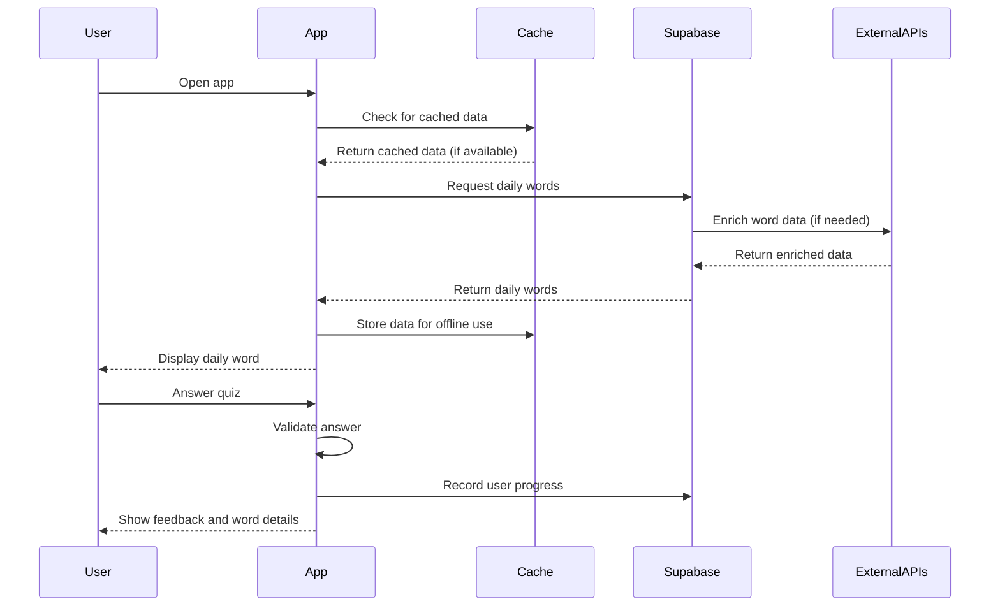

# OneWord Implementation Plan

## GOAL
Develop a mobile application that helps users expand their vocabulary through daily word learning with interactive quizzes and comprehensive word information.

## ARCHITECTURE

### System Overview
OneWord follows a client-server architecture with the following components:

1. **Mobile Client (React Native/Expo)**
   - User interface for word display and interaction
   - Local state management with Zustand
   - Offline caching with AsyncStorage
   - Navigation with Expo Router

2. **Backend (Supabase)**
   - PostgreSQL database for word storage
   - Edge Functions for serverless processing
   - Scheduled jobs for daily word selection
   - Authentication for user tracking

3. **External Services**
   - Gemini API for content generation
   - WordNet for linguistic data
   - Datamuse API for word enrichment

### Data Flow


### Database Schema
The database is structured around these core entities:

1. **Words**: Core word information
   - `words`: Primary word table
   - `word_definitions`: Definitions with sources
   - `word_examples`: Usage examples
   - `word_metadata`: Additional word data

2. **Relationships**: Word connections
   - `synsets`: WordNet synsets
   - `word_synsets`: Word-to-synset mappings
   - `relationships`: Semantic relationships

3. **Daily Words**: Word assignments
   - `daily_words`: Maps dates to words by difficulty
   - `difficulty_bands`: Defines difficulty thresholds

4. **User Data**: User interactions
   - `user_progress`: Tracks user interactions
   - `user_preferences`: Stores user settings

## IMPLEMENTATION

### Phase 1: Core Linguistic Data Enrichment (COMPLETED)
- Imported WordNet data into Supabase
- Collected word frequency data from Datamuse API
- Gathered syllable counts for all words
- Classified words based on eligibility criteria
- Cleaned and normalized word data

### Phase 2: Difficulty Calculation & Scoring (COMPLETED)
- Implemented multi-factor difficulty calculation algorithm
- Created configurable weighting system for factors:
  - Word frequency (55%)
  - Word length (15%)
  - Syllable count (15%)
  - Part of speech complexity (10%)
  - Domain complexity (5%)
- Defined difficulty bands (beginner, intermediate, advanced)
- Processed all words with calculated difficulty scores

### Phase 3: Content Generation (COMPLETED)
- Designed and implemented word enrichment system:
  - Short definitions generation using Gemini API
  - OWAD-style phrase pairs generation
  - Multiple distractor types generation:
    - Semantic network distractors
    - Contextually similar distractors
    - Form-based distractors
- Created robust batch processing system with:
  - API key rotation and rate limit handling
  - Error recovery and checkpoint system
  - Progress monitoring and reporting
  - Adaptive batch sizing and retry logic
- Successfully processed all 68,759 words in the database

### Phase 4: Frontend Implementation (IN PROGRESS)
- Implement core screens:
  - Splash screen with data preloading
  - Home screen with daily word display
  - Quiz interaction with multiple-choice options
  - Word detail view with comprehensive information
  - Timeline navigation for word history
- Add offline support and caching
- Implement user progress tracking
- Create settings and preferences screen

### Phase 5: Advanced Features (PLANNED)
- Implement vocabulary challenges:
  - Meaning Match game
  - Synonym/Antonym Sprint
- Add user profile and statistics
- Create onboarding flow
- Implement notification system
- Add premium features (extended history, calendar)

### Phase 6: Testing & Deployment (PLANNED)
- Conduct unit and integration testing
- Perform end-to-end testing on physical devices
- Set up beta testing through TestFlight/Google Play
- Prepare for production release
- Implement analytics and monitoring

## PACKAGES

### Frontend Dependencies
```json
{
  "dependencies": {
    "expo": "~49.0.0",
    "react": "18.2.0",
    "react-native": "0.72.3",
    "expo-router": "^2.0.0",
    "zustand": "^4.3.9",
    "expo-haptics": "~12.4.0",
    "@supabase/supabase-js": "^2.31.0",
    "expo-secure-store": "~12.3.0",
    "expo-splash-screen": "~0.20.5",
    "expo-status-bar": "~1.6.0",
    "expo-system-ui": "~2.4.0",
    "react-native-reanimated": "~3.3.0",
    "react-native-safe-area-context": "4.6.3",
    "react-native-screens": "~3.22.0"
  }
}
```

### Backend Dependencies
- PostgreSQL database
- Supabase platform services
- Edge Functions runtime
- pg_cron for scheduled jobs
- Node.js for word enrichment utilities
- dotenv for environment management

### External APIs
- Gemini API for content generation
- Datamuse API for word enrichment
- WordNet database for linguistic data 